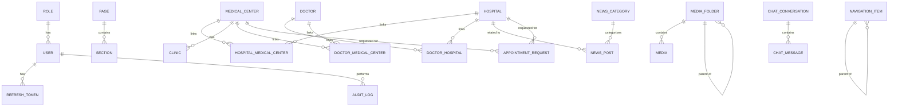

# 03 — Database Schema (Replit Implementation)

# 03 — تصميم قاعدة البيانات الكامل (Complete Database Design)

> **Document Version:** 1.1
> **Status:** Final
> **Last Updated:** 2025-07-16
> **Source of Truth:** Yes

---

## 1. ER Diagram (Mermaid Syntax)



**ملاحظة:** الجداول الأساسية (Hospital, MedicalCenter, Doctor, NewsPost...) كلها مستقلة عن اللغة — النصوص تُخزَّن داخل كل جدول كحقول `Json` بصيغة `{ar, en}` (راجع قسم i18n في [01 — System Architecture](../architecture/01_ARCHITECTURE.md))، فلا حاجة لجداول ترجمة منفصلة.

> **ملاحظة:** لبيانات التحميل الأولي (Seed Data) راجع [16 — Seed Data Specification](16_SEED_DATA_SPECIFICATION.md). لتوثيق كل Endpoint، راجع [04 — API Specification](../api/04_API_SPECIFICATION.md).

---

## 2. لماذا كل جدول موجود؟

| الجدول | السبب |
|---|---|
| `Role` / `User` / `RefreshToken` | نظام مستخدمي لوحة التحكم والصلاحيات + الجلسات الآمنة (JWT) — راجع [05 — User Roles & Permissions](../security/05_USER_ROLES_AND_PERMISSIONS.md) |
| `Page` / `Section` | محرك الـ Page Builder — أي صفحة = مجموعة أقسام قابلة للتحرير بدون كود |
| `Hospital` | المستشفيات كـ Sub-brands (Future, Delta, وأي مستشفى مستقبلي) |
| `MedicalCenter` | المراكز الطبية كـ Signature Brands (الـ12 مركز) |
| `HospitalMedicalCenter` | جدول ربط M:N — يحل مشكلة أن Future تشغّل 4 مراكز وDelta تشغّل الـ12 |
| `Clinic` | العيادات التخصصية داخل كل مركز، وجدول عملها |
| `Doctor` / `DoctorHospital` / `DoctorMedicalCenter` | الأطباء وعلاقتهم (M:N) بالمستشفيات والمراكز |
| `NewsCategory` / `NewsPost` | نظام الأخبار (يدوي + مُزامَن من السوشيال ميديا) |
| `MediaFolder` / `Media` | مكتبة الوسائط المركزية القابلة لإعادة الاستخدام |
| `NavigationItem` | القوائم (Header/Footer) قابلة للتحرير بالكامل من الأدمن |
| `Setting` | كل الإعدادات العامة (Brand, SEO, Social, Security...) كمخزن Key-Value مرن |
| `AppointmentRequest` | طلبات حجز المواعيد من الموقع |
| `ContactSubmission` | رسائل نموذج التواصل |
| `Testimonial` | شهادات المستثمرين/الأطباء/المرضى |
| `AuditLog` | سجل كل عملية إدارية (Compliance + إمكانية Rollback) |
| `ChatConversation` / `ChatMessage` | محادثات الشات بوت (AI) |
| `AiKnowledgeBase` | قاعدة المعرفة التي يديرها الأدمن للـ AI |
| `AiSettings` | إعدادات سلوك المساعد الذكي |
| `IntegrationSetting` | مفاتيح/توكنز التكاملات الخارجية (سوشيال ميديا، Analytics) — مشفّرة |

---

## 3. Prisma Schema الكامل

```prisma
generator client {
  provider = "prisma-client-js"
}

datasource db {
  provider = "postgresql"
  url      = env("DATABASE_URL")
}

// ========================= ENUMS =========================

enum RoleName {
  SUPER_ADMIN
  ADMIN
  MANAGER
  EDITOR
  VIEWER
}

enum ContentStatus {
  DRAFT
  PUBLISHED
  ARCHIVED
}

enum NewsSourceType {
  MANUAL
  SOCIAL_SYNC
}

enum SocialPlatform {
  FACEBOOK
  INSTAGRAM
  LINKEDIN
}

enum SourceEntity {
  INSAN
  FUTURE
  DELTA
}

enum AppointmentStatus {
  NEW
  CONTACTED
  CONFIRMED
  CANCELLED
  COMPLETED
}

enum TestimonialAudience {
  INVESTOR
  DOCTOR
  PATIENT
}

enum ChatSender {
  USER
  AI
  SYSTEM
}

enum MediaType {
  IMAGE
  VIDEO
  PDF
  DOCUMENT
}

// ========================= AUTH / USERS =========================

model Role {
  id          String     @id @default(cuid())
  name        RoleName   @unique
  // permissions: { "pages": ["view","create","edit","delete","publish"], "hospitals": [...], ... }
  permissions Json
  users       User[]
  createdAt   DateTime   @default(now())
  updatedAt   DateTime   @updatedAt
}

model User {
  id            String         @id @default(cuid())
  name          String
  email         String         @unique
  passwordHash  String
  roleId        String
  role          Role           @relation(fields: [roleId], references: [id])
  isActive      Boolean        @default(true)
  avatarUrl     String?
  lastLoginAt   DateTime?
  refreshTokens RefreshToken[]
  auditLogs     AuditLog[]
  createdAt     DateTime       @default(now())
  updatedAt     DateTime       @updatedAt

  @@index([roleId])
  @@index([email])
}

model RefreshToken {
  id        String   @id @default(cuid())
  tokenHash String   @unique
  userId    String
  user      User     @relation(fields: [userId], references: [id], onDelete: Cascade)
  userAgent String?
  ipAddress String?
  expiresAt DateTime
  revoked   Boolean  @default(false)
  createdAt DateTime @default(now())

  @@index([userId])
}

// ========================= CMS CORE =========================

model Page {
  id              String        @id @default(cuid())
  slug            String        @unique
  type            String        @default("standard") // standard | hidden | legal
  title           Json          // {ar, en}
  status          ContentStatus @default(DRAFT)
  metaTitle       Json?
  metaDescription Json?
  ogImage         String?
  canonicalUrl    String?
  robotsIndex     Boolean       @default(true)
  sections        Section[]
  customFields    Json?         @default("{}")
  createdBy       String?
  updatedBy       String?
  publishedAt     DateTime?
  createdAt       DateTime      @default(now())
  updatedAt       DateTime      @updatedAt

  @@index([status])
  @@index([slug])
}

model Section {
  id            String   @id @default(cuid())
  pageId        String
  page          Page     @relation(fields: [pageId], references: [id], onDelete: Cascade)
  componentType String   // "Hero" | "FeatureGrid" | "EntityCards" | "ServiceCards" | ...
  order         Int
  isVisible     Boolean  @default(true)
  config        Json     // كل إعدادات الكومبوننت بما فيها النصوص {ar,en}
  createdAt     DateTime @default(now())
  updatedAt     DateTime @updatedAt

  @@index([pageId, order])
}

// ========================= HOSPITALS / MEDICAL CENTERS =========================

model Hospital {
  id              String                   @id @default(cuid())
  slug            String                   @unique
  name            Json
  shortDescription Json?
  description     Json?
  logoUrl         String?
  heroImage       String?
  brandColor      String?
  status          ContentStatus            @default(DRAFT)
  metaTitle       Json?
  metaDescription Json?
  medicalCenters  HospitalMedicalCenter[]
  doctors         DoctorHospital[]
  newsPosts       NewsPost[]
  appointments    AppointmentRequest[]
  customFields    Json?                    @default("{}")
  createdAt       DateTime                 @default(now())
  updatedAt       DateTime                 @updatedAt

  @@index([status])
}

model MedicalCenter {
  id              String                   @id @default(cuid())
  slug            String                   @unique
  name            Json
  description     Json?
  features        Json?   // [{icon, title:{ar,en}}]
  services        Json?   // [{title:{ar,en}, description:{ar,en}}]
  heroImage       String?
  isFeatured      Boolean                  @default(false)
  status          ContentStatus            @default(DRAFT)
  metaTitle       Json?
  metaDescription Json?
  hospitals       HospitalMedicalCenter[]
  clinics         Clinic[]
  doctors         DoctorMedicalCenter[]
  appointments    AppointmentRequest[]
  customFields    Json?                    @default("{}")
  createdAt       DateTime                 @default(now())
  updatedAt       DateTime                 @updatedAt

  @@index([status])
  @@index([isFeatured])
}

model HospitalMedicalCenter {
  hospitalId      String
  medicalCenterId String
  hospital        Hospital      @relation(fields: [hospitalId], references: [id], onDelete: Cascade)
  medicalCenter   MedicalCenter @relation(fields: [medicalCenterId], references: [id], onDelete: Cascade)
  createdAt       DateTime      @default(now())

  @@id([hospitalId, medicalCenterId])
}

model Clinic {
  id              String        @id @default(cuid())
  medicalCenterId String
  medicalCenter   MedicalCenter @relation(fields: [medicalCenterId], references: [id], onDelete: Cascade)
  name            Json
  schedule        Json          // [{day:"Sunday", from:"10:00", to:"18:00"}]
  createdAt       DateTime      @default(now())
  updatedAt       DateTime      @updatedAt

  @@index([medicalCenterId])
}

model Doctor {
  id           String                @id @default(cuid())
  slug         String                @unique
  name         Json
  title        Json?
  specialty    Json?
  photo        String?
  bio          Json?
  isFeatured   Boolean               @default(false)
  status       ContentStatus         @default(DRAFT)
  hospitals    DoctorHospital[]
  centers      DoctorMedicalCenter[]
  appointments AppointmentRequest[]
  customFields Json?                 @default("{}")
  createdAt    DateTime              @default(now())
  updatedAt    DateTime              @updatedAt

  @@index([status])
  @@index([isFeatured])
}

model DoctorHospital {
  doctorId   String
  hospitalId String
  doctor     Doctor   @relation(fields: [doctorId], references: [id], onDelete: Cascade)
  hospital   Hospital @relation(fields: [hospitalId], references: [id], onDelete: Cascade)

  @@id([doctorId, hospitalId])
}

model DoctorMedicalCenter {
  doctorId        String
  medicalCenterId String
  doctor          Doctor        @relation(fields: [doctorId], references: [id], onDelete: Cascade)
  medicalCenter   MedicalCenter @relation(fields: [medicalCenterId], references: [id], onDelete: Cascade)

  @@id([doctorId, medicalCenterId])
}

// ========================= NEWS =========================

model NewsCategory {
  id    String     @id @default(cuid())
  name  Json
  slug  String     @unique
  posts NewsPost[]
}

model NewsPost {
  id                String          @id @default(cuid())
  slug              String          @unique
  title             Json
  excerpt           Json?
  body              Json?
  featuredImage     String?
  categoryId        String?
  category          NewsCategory?   @relation(fields: [categoryId], references: [id])
  authorId          String?
  status            ContentStatus   @default(DRAFT)
  sourceType        NewsSourceType  @default(MANUAL)
  sourcePlatform    SocialPlatform?
  sourceEntity      SourceEntity?
  externalPostId    String?
  externalPermalink String?
  syncedAt          DateTime?
  relatedHospitalId String?
  relatedHospital   Hospital?       @relation(fields: [relatedHospitalId], references: [id])
  metaTitle         Json?
  metaDescription   Json?
  publishedAt       DateTime?
  createdAt         DateTime        @default(now())
  updatedAt         DateTime        @updatedAt

  @@index([status, publishedAt])
  @@index([sourceType])
  @@unique([sourcePlatform, externalPostId])
}

// ========================= MEDIA =========================

model MediaFolder {
  id       String        @id @default(cuid())
  name     String
  parentId String?
  parent   MediaFolder?  @relation("FolderTree", fields: [parentId], references: [id])
  children MediaFolder[] @relation("FolderTree")
  media    Media[]
  createdAt DateTime     @default(now())
}

model Media {
  id         String       @id @default(cuid())
  url        String
  type       MediaType
  altText    Json?
  tags       String[]
  folderId   String?
  folder     MediaFolder? @relation(fields: [folderId], references: [id])
  sizeBytes  Int?
  width      Int?
  height     Int?
  uploadedBy String?
  createdAt  DateTime     @default(now())

  @@index([folderId])
  @@index([type])
}

// ========================= NAVIGATION / SETTINGS =========================

model NavigationItem {
  id       String           @id @default(cuid())
  label    Json
  target   String           // page slug أو external URL
  parentId String?
  parent   NavigationItem?  @relation("NavTree", fields: [parentId], references: [id])
  children NavigationItem[] @relation("NavTree")
  location String           // "header" | "footer"
  order    Int
  isVisible Boolean         @default(true)

  @@index([location, order])
}

model Setting {
  key       String   @id
  group     String   // general | brand | social | integrations | languages | security | seo
  value     Json
  updatedAt DateTime @updatedAt
}

model IntegrationSetting {
  id             String   @id @default(cuid())
  provider       String   @unique // e.g. "facebook_page_insan", "ga4", "gtm", "linkedin_page_future"
  encryptedValue String
  isActive       Boolean  @default(true)
  updatedAt      DateTime @updatedAt
}

// ========================= LEADS =========================

model AppointmentRequest {
  id              String              @id @default(cuid())
  name            String
  phone           String
  email           String?
  hospitalId      String?
  hospital        Hospital?           @relation(fields: [hospitalId], references: [id])
  medicalCenterId String?
  medicalCenter   MedicalCenter?      @relation(fields: [medicalCenterId], references: [id])
  doctorId        String?
  doctor          Doctor?             @relation(fields: [doctorId], references: [id])
  preferredDate   DateTime?
  message         String?
  status          AppointmentStatus   @default(NEW)
  createdAt       DateTime            @default(now())
  updatedAt       DateTime            @updatedAt

  @@index([status])
  @@index([createdAt])
}

model ContactSubmission {
  id        String   @id @default(cuid())
  name      String
  email     String
  phone     String?
  subject   String?
  message   String
  isRead    Boolean  @default(false)
  createdAt DateTime @default(now())

  @@index([isRead])
}

// ========================= TESTIMONIALS =========================

model Testimonial {
  id        String               @id @default(cuid())
  name      String
  audience  TestimonialAudience
  quote     Json
  photo     String?
  status    ContentStatus        @default(DRAFT)
  order     Int                  @default(0)
  createdAt DateTime             @default(now())
  updatedAt DateTime             @updatedAt
}

// ========================= AUDIT =========================

model AuditLog {
  id        String   @id @default(cuid())
  userId    String?
  user      User?    @relation(fields: [userId], references: [id])
  action    String   // create | update | delete | publish | login | logout
  entity    String   // "Page" | "Hospital" | ...
  entityId  String?
  before    Json?
  after     Json?
  ipAddress String?
  createdAt DateTime @default(now())

  @@index([entity, entityId])
  @@index([userId])
  @@index([createdAt])
}

// ========================= AI CHAT =========================

model ChatConversation {
  id        String        @id @default(cuid())
  visitorId String        // UUID مجهول يُخزَّن بالـ Cookie
  locale    String
  startedAt DateTime      @default(now())
  endedAt   DateTime?
  messages  ChatMessage[]

  @@index([visitorId])
}

model ChatMessage {
  id             String           @id @default(cuid())
  conversationId String
  conversation   ChatConversation @relation(fields: [conversationId], references: [id], onDelete: Cascade)
  sender         ChatSender
  content        String
  matchedKbId    String?
  isUnanswered   Boolean          @default(false)
  createdAt      DateTime         @default(now())

  @@index([conversationId])
  @@index([isUnanswered])
}

model AiKnowledgeBase {
  id        String   @id @default(cuid())
  topic     Json
  question  Json
  answer    Json
  category  String?
  isActive  Boolean  @default(true)
  createdAt DateTime @default(now())
  updatedAt DateTime @updatedAt

  @@index([isActive])
}

model AiSettings {
  key   String @id
  value Json
}
```

---

## 4. ملاحظات تصميمية مهمة

- **الحقول متعددة اللغات (`Json`):** أي حقل نصي موجّه للزائر مخزّن `{ "ar": "...", "en": "..." }`. الفاليديشن على مستوى الـ API يتأكد إن الحقل يحتوي على الأقل مفتاح `ar` (اللغة الأساسية) قبل النشر.
- **`customFields Json` على الكيانات الرئيسية:** بوابة توسّع رسمية — أي حقل جديد يحتاجه صاحب المشروع مستقبلاً (مثال: "رقم ترخيص المستشفى") يُضاف هنا فوراً بدون Migration، ثم يُرفَّع لعمود حقيقي لاحقاً لو استقرّ الاستخدام.
- **الفهارس (Indexes):** على كل الحقول المستخدمة في الفلترة/الترتيب المتكرر (`status`, `slug`, `createdAt`, `isFeatured`) لضمان أداء جيد مع نمو البيانات.
- **الحذف المتسلسل (`onDelete: Cascade`):** مطبّق على العلاقات التابعة بالكامل لكيان أب (مثال: حذف صفحة يحذف أقسامها) لتفادي بيانات يتيمة.
- **جداول الربط الصريحة (`HospitalMedicalCenter`, `DoctorHospital`, `DoctorMedicalCenter`):** بدل Implicit M:N في Prisma، لأنها تسمح بإضافة حقول على العلاقة نفسها مستقبلاً (مثال: `isPrimaryCenter Boolean`).
- **بيانات التحميل الأولي:** لقائمة البيانات الأولية (Roles, Settings, Seed hospitals/centers)، راجع [16 — Seed Data Specification](16_SEED_DATA_SPECIFICATION.md).

---

## 5. Delete Behavior Matrix

> Every `onDelete` directive in the Prisma schema is listed below. If a relation is not listed, it has **no explicit `onDelete`** — Prisma defaults to client-side restrict (the operation fails if dependent records exist).

### Owned Children (Cascade on parent delete)

| Parent Entity | Child Entity | Relation | `onDelete` |
|---|---|---|---|
| `Page` | `Section` | 1:N | **Cascade** |
| `User` | `RefreshToken` | 1:N | **Cascade** |
| `ChatConversation` | `ChatMessage` | 1:N | **Cascade** |
| `MediaFolder` | `Media` | 1:N | **Restrict** (no directive — default) |
| `MediaFolder` | `MediaFolder` (children) | Self-relation | **Restrict** (no directive — default) |
| `NewsCategory` | `NewsPost` | 1:N | **Restrict** (no directive — default) |

### Junction Tables (Cascade on either parent delete)

| Junction Table | Parent A | Parent B | `onDelete` (A) | `onDelete` (B) |
|---|---|---|---|---|
| `HospitalMedicalCenter` | `Hospital` | `MedicalCenter` | **Cascade** | **Cascade** |
| `DoctorHospital` | `Doctor` | `Hospital` | **Cascade** | **Cascade** |
| `DoctorMedicalCenter` | `Doctor` | `MedicalCenter` | **Cascade** | **Cascade** |

> Junction rows are automatically cleaned when either parent is deleted. No orphaned links remain.

### Optional References (Set Null / Restrict)

| Parent Entity | Referenced From | FK Field | `onDelete` |
|---|---|---|---|
| `Hospital` | `NewsPost` | `relatedHospitalId` | **Restrict** (no directive — default) |
| `Hospital` | `AppointmentRequest` | `hospitalId` | **Restrict** (no directive — default) |
| `MedicalCenter` | `AppointmentRequest` | `medicalCenterId` | **Restrict** (no directive — default) |
| `Doctor` | `AppointmentRequest` | `doctorId` | **Restrict** (no directive — default) |
| `NewsCategory` | `NewsPost` | `categoryId` | **Restrict** (no directive — default) |
| `MediaFolder` | `Media` | `folderId` | **Restrict** (no directive — default) |
| `MediaFolder` | `MediaFolder` | `parentId` | **Restrict** (no directive — default) |
| `NavigationItem` | `NavigationItem` | `parentId` | **Restrict** (no directive — default) |
| `User` | `AuditLog` | `userId` | **Restrict** (no directive — default) |

> **Important:** All optional FK references without an explicit `onDelete` directive default to Prisma's client-side restrict. This means deleting a Hospital that has AppointmentRequests will **fail** — you must reassign or delete the appointments first.

### Independent Entities (No FK references to/from)

| Entity | Notes |
|---|---|
| `Role` | Cannot be deleted while Users reference it |
| `Setting` | Key-value store; rows are upserted, not deleted |
| `IntegrationSetting` | Standalone; deleted by admin when removing an integration |
| `Testimonial` | Standalone; no FK dependencies |
| `ContactSubmission` | Standalone; admin deletes individually |
| `AiKnowledgeBase` | Standalone; admin manages entries |
| `AiSettings` | Key-value store; rows are upserted |
| `AuditLog` | Append-only; never deleted (retention policy applied externally) |

---

## 6. Deletion Policy (Soft Delete vs Hard Delete)

### Soft Delete

**No entity in this schema uses Soft Delete.** There is no `deletedAt` field on any model.

All content lifecycle management is handled through the `ContentStatus` enum (`DRAFT` → `PUBLISHED` → `ARCHIVED`), not through soft deletion.

### Hard Delete

All deletions are **hard deletes** (physical row removal). The applicable behavior depends on the entity type:

| Entity Type | Deletion Behavior | Admin Can Delete? | Notes |
|---|---|---|---|
| **CMS Content** (Page, Section, Hospital, MedicalCenter, Doctor, NewsPost, NewsCategory, NavigationItem, Testimonial) | Hard delete with cascade where applicable | Yes | Must be in DRAFT or ARCHIVED status before deletion (enforce in API layer) |
| **Owned Children** (RefreshToken, ChatMessage, Clinic) | Cascade hard delete | Indirectly (parent deletion) | Cannot be deleted independently |
| **Junction Rows** (HospitalMedicalCenter, DoctorHospital, DoctorMedicalCenter) | Cascade hard delete | Yes (unlink operation) | Deleting the junction row removes the association, not the entities |
| **Lead Data** (AppointmentRequest, ContactSubmission) | Hard delete | Yes | Admin can delete individual records; no cascade dependencies |
| **User Accounts** | Hard delete with cascade (RefreshTokens, AuditLogs) | Super Admin only | Cannot delete own account; must transfer ownership first |
| **System Records** (AuditLog, Setting, IntegrationSetting, AiSettings) | Hard delete individually | Settings: Admin; AuditLog: never delete | AuditLog retention is external (e.g., 90-day archival to cold storage) |

### API-Layer Enforcement

Before any hard delete, the API layer must enforce:
1. **Status check:** CMS entities must be `DRAFT` or `ARCHIVED` before deletion. If `PUBLISHED`, return error: `"Cannot delete published entity. Archive it first."`
2. **Dependency check:** For entities with Restrict relations, verify no dependent records exist. If they do, return error with count: `"Cannot delete: 3 appointment requests reference this entity."`
3. **Confirmation gate:** Destructive operations require explicit confirmation token (generated on first request, validated on confirm).

---

## 7. Slug Rules

### Auto-Generation

| Entity | Auto-generate? | Source | Method |
|---|---|---|---|
| `Hospital` | Yes | `name.en` | `slugify(name.en)` — lowercase, replace spaces with `-`, remove special chars |
| `MedicalCenter` | Yes | `name.en` | Same as above |
| `Doctor` | Yes | `name.en` | Same as above |
| `NewsPost` | Yes | `title.en` | Same as above |
| `NewsCategory` | Yes | `name.en` | Same as above |
| `Page` | **Manual** | Admin input | Admin types slug in Page Builder; validated for format on save |

### Editability

| Entity | Slug editable after creation? | Notes |
|---|---|---|
| `Page` | Yes | Admin can change slug; old slug gets redirect |
| `Hospital` | Yes | Admin can change slug; old slug gets redirect |
| `MedicalCenter` | Yes | Admin can change slug; old slug gets redirect |
| `Doctor` | Yes | Admin can change slug; old slug gets redirect |
| `NewsPost` | Yes | Admin can change slug; old slug gets redirect |
| `NewsCategory` | Yes | Admin can change slug; old slug gets redirect |

### Uniqueness

**All slugs are globally unique** — enforced by `@unique` constraint in Prisma on every slug field. There is no scoped uniqueness in this schema.

### Slug Change Behavior

When an admin changes a slug:

1. **Old slug is preserved** in a `SlugHistory` record (implement as a new table or as a JSON array on the entity — recommended: separate `SlugHistory` table for simplicity):

```prisma
model SlugHistory {
  id          String   @id @default(cuid())
  entity      String   // "Page" | "Hospital" | "MedicalCenter" | "Doctor" | "NewsPost" | "NewsCategory"
  entityId    String
  oldSlug     String
  newSlug     String
  changedAt   DateTime @default(now())

  @@index([entity, entityId])
  @@index([oldSlug])
}
```

2. **Old slug continues to work** via redirect (see Redirect Policy below).
3. **New slug is immediately active** for all new URLs.

### Redirect Policy

When a slug changes, create a 301 redirect record:

```prisma
model Redirect {
  id          String   @id @default(cuid())
  fromPath    String   @unique  // e.g. "/en/hospitals/old-slug"
  toPath      String            // e.g. "/en/hospitals/new-slug"
  statusCode  Int      @default(301)  // 301 permanent, 302 temporary
  createdAt   DateTime @default(now())
  expiresAt   DateTime?          // null = permanent; set for auto-cleanup

  @@index([fromPath])
}
```

**Rules:**
- Redirects are created automatically by the API when a slug changes.
- Redirects are **never deleted automatically** — they accumulate to preserve old links.
- External cleanup (e.g., after 12 months of zero hits) is handled by a scheduled job, not by the API layer.
- The frontend middleware checks the `Redirect` table before rendering a 404.

---

## 8. Ordering Policy

### Entities with `order` Field

| Entity | Field | Type | Scope | Notes |
|---|---|---|---|---|
| `Section` | `order` | `Int` | Per `Page` (`@@index([pageId, order])`) | Sections within a single page |
| `NavigationItem` | `order` | `Int` | Per `location` (`@@index([location, order])`) | Items within header or footer |
| `Testimonial` | `order` | `Int` | Global (no scope) | Display order across all testimonials |

### Ordering Rules

1. **Integer sequence starting from 1.** No zero, no negatives.
2. **Gaps are allowed** but discouraged. If gaps occur (e.g., after deletion), the API should **re-sequence** the remaining items on the next reorder operation.
3. **Drag-and-drop reordering** is implemented as a batch update:
   - Frontend sends an array of `{ id, order }` pairs for all visible items in the new sequence.
   - Backend updates all items in a single transaction.
   - No partial updates — the entire sequence is replaced atomically.
4. **Insertion:** New items are appended at the end (max order + 1). Admin can specify a position via `insertAt` parameter which shifts subsequent items.
5. **Deletion:** When an item is deleted, its gap is closed by decrementing all items with `order > deletedOrder` within the same scope.
6. **Visibility:** `isVisible` (on Section, NavigationItem) does not affect order. Hidden items retain their position and reappear at the same spot when unhidden.

### Re-sequence Endpoint

```
PATCH /admin/{entity}/reorder
Body: { items: [{ id: "abc", order: 1 }, { id: "def", order: 2 }, ...] }
```

This replaces the entire order sequence for the given scope. The backend validates:
- All IDs exist within the scope.
- Orders are contiguous starting from 1.
- No duplicate orders.

---

## 9. `customFields` JSON Structure

### Purpose

`customFields` is an **extensibility escape hatch** — it allows the project owner to add arbitrary key-value data to entities without a database migration. Once a custom field is used consistently, it should be promoted to a real column in a future migration.

### Schema

Every `customFields` field follows this structure:

```json
{
  "fieldName": {
    "label": {
      "ar": "الاسم بالعربي",
      "en": "Field Label in English"
    },
    "value": "The actual data",
    "type": "string"
  }
}
```

### Field Types

| `type` value | `value` format | Example |
|---|---|---|
| `"string"` | `"some text"` | `"license-number": { "label": {...}, "value": "MOH-12345", "type": "string" }` |
| `"number"` | `42` or `3.14` | `"bed-count": { "label": {...}, "value": 150, "type": "number" }` |
| `"boolean"` | `true` / `false` | `"has-emergency": { "label": {...}, "value": true, "type": "boolean" }` |
| `"date"` | `"2026-01-15"` (ISO 8601) | `"established-date": { "label": {...}, "value": "2020-06-01", "type": "date" }` |
| `"json"` | Any valid JSON | `"operating-hours": { "label": {...}, "value": {"sat":"8-4","sun":"8-4"}, "type": "json" }` |

### Representative Example

```json
{
  "licenseNumber": {
    "label": { "ar": "رقم الترخيص", "en": "License Number" },
    "value": "MOH-CAI-2024-00123",
    "type": "string"
  },
  "bedCount": {
    "label": { "ar": "عدد الأسرّة", "en": "Bed Count" },
    "value": 200,
    "type": "number"
  },
  "isEmergencyReady": {
    "label": { "ar": "جاهزية الطوارئ", "en": "Emergency Ready" },
    "value": true,
    "type": "boolean"
  },
  "accreditations": {
    "label": { "ar": "الاعتمادات", "en": "Accreditations" },
    "value": ["JCI", "ISO-9001", "NABH"],
    "type": "json"
  }
}
```

### Rules

1. **Label is required** — every custom field must have a bilingual label for the admin UI to render it correctly.
2. **Type is required** — the admin UI uses this to render the correct input type (text, number, toggle, date picker).
3. **Top-level keys are camelCase** — no nested objects at the top level. The `value` can be any depth.
4. **Max recommended size:** 16KB per `customFields` column. If data exceeds this, promote to a real column.
5. **Admin UI discovery:** The admin panel reads `customFields` keys dynamically and renders them in an "Additional Fields" section on the entity edit screen. No code change needed to add a new custom field.

---

**التالي:** [04 — API Specification](../api/04_API_SPECIFICATION.md) — توثيق كل Endpoint بالتفصيل.